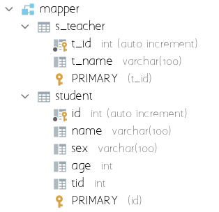
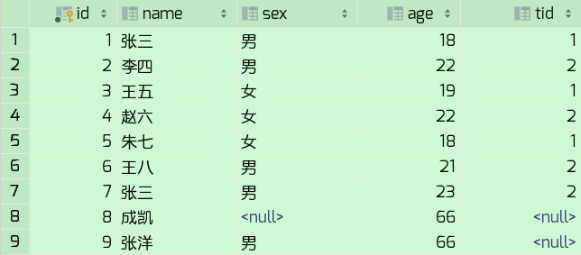
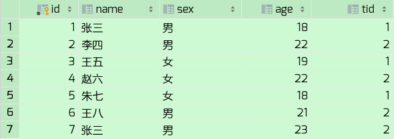
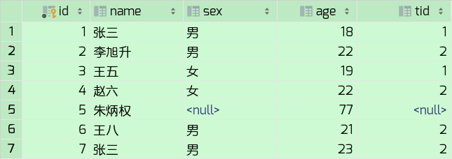
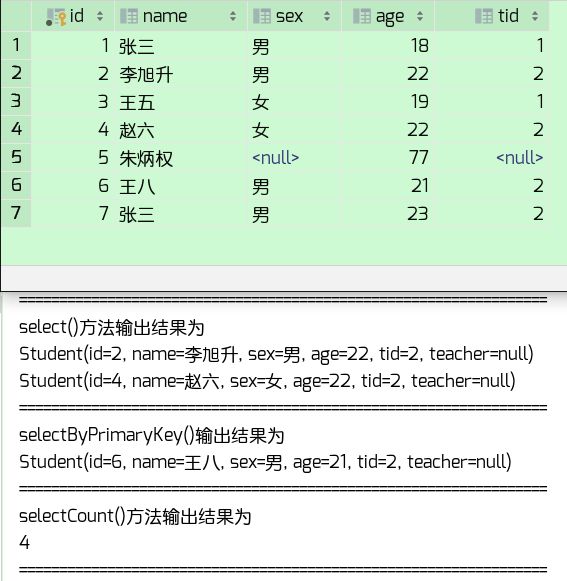
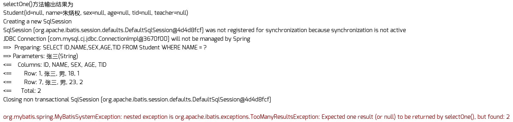
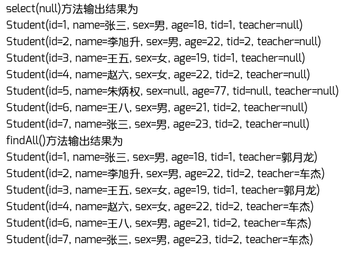
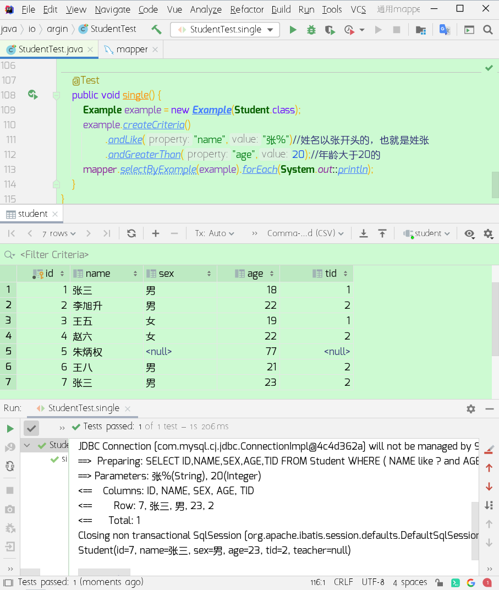

##一、前期环境准备

###1.创建数据库

很简单的学生表和老师表



```sql
create database mapper;
use mapper;

create table student
(
    id int primary key auto_increment,
    name varchar(100),
    sex varchar(100) default '男',
    age int,
    tid int
);

create table s_teacher
(
    t_id int primary key auto_increment,
    t_name varchar(100)
);

insert into student values
(1,'张三','男',18,1),
(2,'李四','男',22,2),
(3,'王五','女',19,1),
(4,'赵六','女',22,2),
(5,'朱七','女',18,1),
(6,'王八','男',21,2),
(7,'张三','男',23,2);

insert into s_teacher values
(1,'郭月龙'),
(2,'车杰');
```

###2.创建Mven工程，加入依赖

```xml
<dependencies>
    
    <!--单元测试-->
    <dependency>
        <groupId>junit</groupId>
        <artifactId>junit</artifactId>
        <version>4.12</version>
        <scope>test</scope>
    </dependency>

    <!--druid数据库连接池-->
    <dependency>
        <groupId>com.alibaba</groupId>
        <artifactId>druid</artifactId>
        <version>1.2.3</version>
    </dependency>

    <!--mysql数据库连接驱动-->
    <dependency>
        <groupId>mysql</groupId>
        <artifactId>mysql-connector-java</artifactId>
        <version>8.0.21</version>
        <scope>runtime</scope>
    </dependency>

    <!--通用mapper-->
    <dependency>
        <groupId>com.github.abel533</groupId>
        <artifactId>mapper</artifactId>
        <version>3.0.1</version>
    </dependency>

    <!--Mybatis相关依赖-->
    <dependency>
        <groupId>org.mybatis</groupId>
        <artifactId>mybatis</artifactId>
        <version>3.5.6</version>
    </dependency>
    <dependency>
        <groupId>org.mybatis</groupId>
        <artifactId>mybatis-spring</artifactId>
        <version>2.0.6</version>
    </dependency>

    <!--Spring相关依赖-->
    <dependency>
        <groupId>org.springframework</groupId>
        <artifactId>spring-core</artifactId>
        <version>5.3.1</version>
    </dependency>
    <dependency>
        <groupId>org.springframework</groupId>
        <artifactId>spring-beans</artifactId>
        <version>5.3.1</version>
    </dependency>
    <dependency>
        <groupId>org.springframework</groupId>
        <artifactId>spring-jdbc</artifactId>
        <version>5.3.1</version>
    </dependency>
    <dependency>
        <groupId>org.springframework</groupId>
        <artifactId>spring-context</artifactId>
        <version>5.3.1</version>
    </dependency>
    <dependency>
        <groupId>org.springframework</groupId>
        <artifactId>spring-test</artifactId>
        <version>5.3.1</version>
    </dependency>
    <dependency>
        <groupId>org.springframework</groupId>
        <artifactId>spring-tx</artifactId>
        <version>5.3.1</version>
    </dependency>

    <!-- lombok -->
    <dependency>
        <groupId>org.projectlombok</groupId>
        <artifactId>lombok</artifactId>
        <version>1.18.16</version>
        <scope>provided</scope>
    </dependency>
    
</dependencies>
```

###3.创建实体类

Student.java

```java
import lombok.Data;

import javax.persistence.Id;
import javax.persistence.Transient;

@Data
public class Student {
    @Id
    private Integer id;
    private String name;
    private String sex;
    private Integer age;
    private Integer tid;
    @Transient
    private String teacher;
}
```

Teacher.java

```java
import lombok.Data;

import javax.persistence.Column;
import javax.persistence.Id;
import javax.persistence.Table;

@Data
@Table(name = "s_teacher")
public class Teacher {
    @Id
    @Column(name = "t_id")
    private Integer id;
    @Column(name = "t_name")
    private String name;
}
```

注意事项：

@Id

有主键必须加，否则用有主键的方法会报错

@Table

如果数据库表名和实体类类名一致就可以不用加（比如Student）

如果数据库表名和实体类类名不一致就必须加（比如Teacher），并用name指定表名

@Column

如果数据库表中字段名和实体类字段名一致就可以不用加（比如Student）

如果数据库表中字段名和实体类字段名不一致就必须加（比如Teacher），并用name指定字段名

@Transient

如果表中没有该字段，实体类有，那么这个字段需要加注解

比如student表中只有教师主键tid 没有教师姓名但是实体类有教师姓名teacher 那么这个teacher就要加注解

@Data

和通用Mapper没有任何关系，此注解表示编译时自动生成get、set、toString等方法

###4.创建Mapper接口

StudentMapper.java

```java
import com.github.abel533.mapper.Mapper;
import io.argin.bean.Student;

import java.util.List;

public interface StudentMapper extends Mapper<Student> {
    List<Student> findAll();//自己写的方法
}
```

TeacherMapper.java

```java
import com.github.abel533.mapper.Mapper;
import io.argin.bean.Teacher;

public interface TeacherMapper extends Mapper<Teacher> {

}
```

创建Mapper接口的时候继承com.github.abel533.mapper.Mapper类，并加上实体类泛型

此时就表示这个接口有了很多增删改查方法，在service层直接调用即可，无需，也不能重写这些方法

一会儿来我会演示这些方法都有些什么

###5.创建Mybatis映射文件

StudentMapper.xml

```xml
<?xml version="1.0" encoding="UTF-8" ?>
<!DOCTYPE mapper PUBLIC "-//mybatis.org//DTD Mapper 3.0//EN" "http://mybatis.org/dtd/mybatis-3-mapper.dtd">
<mapper namespace="io.argin.mapper.StudentMapper">
    <select id="findAll" resultType="io.argin.bean.Student">
        select s.*, t.t_name teacher from student s join s_teacher t on s.tid = t.t_id
    </select>
</mapper>
```

###6.创建Mybatis配置文件

mybatis-config.xml

```xml
<?xml version="1.0" encoding="UTF-8" ?>
<!DOCTYPE configuration PUBLIC "-//mybatis.org//DTD Config 3.0//EN" "http://mybatis.org/dtd/mybatis-3-config.dtd">
<configuration>

    <settings>
        <!--  自带日志实现  -->
        <setting name="logImpl" value="STDOUT_LOGGING"/>
    </settings>

    <plugins>
        <!--  通用mapper  -->
        <plugin interceptor="com.github.abel533.mapperhelper.MapperInterceptor">
            <property name="identity" value="mysql"/>
            <property name="mappers" value="com.github.abel533.mapper.Mapper"/>
        </plugin>
    </plugins>

</configuration>
```

###7.创建Spring配置文件

spring-mybatis.xml

```xml
<?xml version="1.0" encoding="utf-8"?>
<beans xmlns="http://www.springframework.org/schema/beans"
       xmlns:xsi="http://www.w3.org/2001/XMLSchema-instance"
       xsi:schemaLocation="
        http://www.springframework.org/schema/beans
	    http://www.springframework.org/schema/beans/spring-beans.xsd">

    <!--  配置数据源  -->
    <bean id="dataSource" class="com.alibaba.druid.pool.DruidDataSource" init-method="init" destroy-method="close">
        <property name="url" value="jdbc:mysql://localhost:3306/mapper"/>
        <property name="username" value="root"/>
        <property name="password" value="root"/>
    </bean>

    <!--  配置sqlSessionFactory  -->
    <bean id="sqlSessionFactory" class="org.mybatis.spring.SqlSessionFactoryBean">
        <!--  注入数据源  -->
        <property name="dataSource" ref="dataSource"/>
        <!--  注入Mybatis映射文件  -->
        <property name="mapperLocations" value="classpath:mappers/*.xml"/>
        <!--  注入Mybatis配置文件  -->
        <property name="configLocation" value="classpath:mybatis-config.xml"/>
    </bean>

    <!--  配置要代理的Mapper  -->
    <bean class="org.mybatis.spring.mapper.MapperScannerConfigurer">
        <property name="sqlSessionFactoryBeanName" value="sqlSessionFactory"/>
        <property name="basePackage" value="io.argin.mapper"/>
    </bean>

</beans>
```

###8.创建测试类

StudentTest.java

```java
import io.argin.mapper.StudentMapper;
import org.junit.Test;
import org.junit.runner.RunWith;
import org.springframework.beans.factory.annotation.Autowired;
import org.springframework.test.context.ContextConfiguration;
import org.springframework.test.context.junit4.SpringJUnit4ClassRunner;

//加载spring配置文件
@RunWith(SpringJUnit4ClassRunner.class)
@ContextConfiguration(locations = "classpath:spring-mybatis.xml")
public class StudentTest {

    @Autowired
    private StudentMapper mapper;

}
```

TeacherTest.java

```java
import io.argin.mapper.TeacherMapper;
import org.junit.Test;
import org.junit.runner.RunWith;
import org.springframework.beans.factory.annotation.Autowired;
import org.springframework.test.context.ContextConfiguration;
import org.springframework.test.context.junit4.SpringJUnit4ClassRunner;

//加载spring配置文件
@RunWith(SpringJUnit4ClassRunner.class)
@ContextConfiguration(locations = "classpath:spring-mybatis.xml")
public class TeacherTest {

    @Autowired
    private TeacherMapper mapper;

}
```

##二、基础使用

| 方法                             | 说明                                       |
| -------------------------------- | ------------------------------------------ |
| insert(T t)                      | 插入一条数据                               |
| insertSelective(T t)             | 插入一条数据                               |
| delete(T t)                      | 根据条件删除数据                           |
| deleteByPrimaryKey(Object key)   | 根据主键删除数据                           |
| updateByPrimaryKey(T t)          | 修改数据                                   |
| updateByPrimaryKeySelective(T t) | 修改数据                                   |
| select(T t)                      | 根据条件查询数据（传null则查全部）         |
| selectByPrimaryKey(Object key)   | 根据主键查询数据                           |
| selectOne(T t)                   | 根据条件查询数据（如果结果不为一条则报错） |
| selectCount(T t)                 | 根据条件统计个数                           |

###1.添加方法

##### insert(T t)

##### insertSelective(T t)

添加方法有两个，有什么区别呢？举个例子说明一下，运行以下测试方法

```java
@Test
public void insert() {
    Student s1 = new Student();
    s1.setName("成凯");
    s1.setAge(66);
    mapper.insert(s1);

    Student s2 = new Student();
    s2.setName("张洋");
    s2.setAge(66);
    mapper.insertSelective(s2);
}
```

学生表中 性别这个字段是有默认值的(男)



可以看出，insert()方法忽视了数据库的默认值，也就是说它是严格按照所传实体类的数据添加；

而insertSelective()方法是有选择性的，空值我不管，非空值我才管 （selective：有选择性的）。

###2.删除方法

##### delete(T t)

##### deleteByPrimaryKey(Object key)

见名知意，delete()是根据所传实体类条件删除，deleteByPrimaryKey()是根据主键删除

```java
@Test
public void delete() {
    Student s1 = new Student();
    s1.setName("张洋");
    mapper.delete(s1);

    mapper.deleteByPrimaryKey(8);
}
```

运行以上测试方法，刚刚插入的两条数据删除



###3.修改方法

#####updateByPrimaryKey(T t)

#####updateByPrimaryKeySelective(T t)

他们类似添加方法的insert()和insertSelective()

前者是严格按照实体类所传的数据修改，后者是传则改，不传则不改

运行以下测试方法

```java
@Test
public void update() {
    Student s1 = new Student();
    s1.setId(5);
    s1.setName("朱炳权");
    s1.setAge(77);
    mapper.updateByPrimaryKey(s1);

    Student s2 = new Student();
    s2.setId(2);
    s2.setName("李旭升");
    s2.setAge(22);
    mapper.updateByPrimaryKeySelective(s2);
}
```



如图所示，s1用的是updateByPrimaryKey()方法、s2用的是updateByPrimaryKeySelective()方法

朱炳权只设置了姓名和年龄属性，它是严格按照所传数据修改，所以只有这两个属性有值（主键除外）

李旭升也只设置了姓名和年龄属性，但是它是有选择性的修改，所有都有值

###4.查询方法

#####select(T t)

#####selectByPrimaryKey(Object key)

#####selectCount(T t)

运行以下测试方法

```java
@Test
public void select() {
    Student s1 = new Student();
    s1.setAge(22);
    List<Student> ls1 = mapper.select(s1);//年龄是22的学生

    Student s2 = mapper.selectByPrimaryKey(6);//主键是6的学生

    Student s3= new Student();
    s3.setSex("男");
    int count = mapper.selectCount(s3);//性别是男的人数
    
    System.out.println("==================================================================");
    System.out.println("select()方法输出结果为");
    ls1.forEach(System.out::println);
    System.out.println("==================================================================");
    System.out.println("selectByPrimaryKey()输出结果为");
    System.out.println(s2);
    System.out.println("==================================================================");
    System.out.println("selectCount()方法输出结果为");
    System.out.println(count);
    System.out.println("==================================================================");
}
```

结果和表中数据也没有任何问题




#####selectOne()

运行以下测试方法

```java
@Test
public void selectOne() {
    Student s1 = new Student();
    s1.setName("朱炳权");
    mapper.selectOne(s1);
    System.out.println("selectOne()方法输出结果为");
    System.out.println(s1);
    
    Student s2 = new Student();
    s2.setName("张三");
    mapper.selectOne(s2);
}
```



第一个没问题，第二个抛出了个异常

`TooManyResultsException:Expected one result (or null) to be returned by selectOne(), but found:2`

翻译一下

`太多结果异常：seleceOne()方法的返回值应该是一个(或空)，但是找到了两个`

问题显而易见了，所以使用时要注意这一点


那么如何查询全部呢？

运行以下测试方法

```java
@Test
public void selectAll() {
    List<Student> list = mapper.select(null);//通用mapper自带
    List<Student> all = mapper.findAll();//手动在映射文件编写SQL语句

    System.out.println("select(null)方法输出结果为");
    list.forEach(System.out::println);

    System.out.println("findAll()方法输出结果为");
    all.forEach(System.out::println);
}
```



自定义的findAll方法少了一个值的原因是，这个方法是两表关联查询

`select s.*, t.t_name teacher from student s join s_teacher t on s.tid = t.t_id`

在上面测试修改的时候把朱炳权的tid修改成null值，所以此处没有关联到

所以通用mapper有个缺陷就是适合单表操作，不太适合多表关联操作。

其实也不是不能，只是相对来说有点复杂，是 把两个表的数据都查出来，然后再用java代码完成关联字段的映射

以后工作的时候应该会用。当数据库数据较多时，查询数据库是比较慢的，所以实际开发中一般都是全表扫描然后讲查询到的数据加载到内存中，然后通过Java代码进行后续的处理，不过这样的操作会占用大量内存，也就是用空间换时间。

剩下的那个Teacher，那个表名和字段名和实体类不一致，需要加注解@Column用name指定字段名处理，否则会报错，可以尝试以下，这里就不作过多阐述了。

##三、进阶使用

> 主要是Example的使用，它提供了大量的方法来筛选查询条件

| 方法名                                   | 说明             |
| ---------------------------------------- | ---------------- |
| selectByExample(Object example)          | 根据条件查询     |
| selectCountByExample(Object example)     | 根据条件统计个数 |
| deleteByExample(Object example)          | 根据条件删除     |
| updateByExample(Object example)          | 根据条件修改     |
| updateByExampleSelective(Object example) | 根据条件修改     |

### 1.首先简单的举个例子演示一下

先新建一个Example对象，构造方法里传入实体类.class

`Example example = new Example(Student.class);`

然后调用`createCriteria()`方法添加查询条件

具体呢就是这样，运行以下测试代码

```java
@Test
public void single() {
    Example example = new Example(Student.class);
    example.createCriteria()
        .andLike("name","张%")//姓名以张开头的，也就是姓张
        .andGreaterThan("age",20);//年龄大于20的
    mapper.selectByExample(example).forEach(System.out::println);
}
```



###2.空值判断

#####andIsNull(String property)

查询是空的数据

##### andIsNotNull(String property)

查询不是空的数据

```java
@Test
public void andIsNull() {
    Example example = new Example(Student.class);
    example.createCriteria().andIsNull("sex");
    mapper.selectByExample(example);//查询sex列是空的数据
}
@Test
public void andIsNotNull() {
    Example example = new Example(Student.class);
    example.createCriteria().andIsNotNull("sex");
    mapper.selectByExample(example);//查询sex列不是空的数据
}
```

### 3.条件判断

#####andEqualTo(String property, Object value)

查询内容相同的

#####andNotEqualTo(String property, Object value)

查询内容不相同的

```java
@Test
public void andEqualTo() {
    Example example = new Example(Student.class);
    example.createCriteria().andEqualTo("name","张三");
    mapper.selectByExample(example);//查询name列是张三的数据
}
@Test
public void andNotEqualTo() {
    Example example = new Example(Student.class);
    example.createCriteria().andNotEqualTo("name","张三");
    mapper.selectByExample(example);//查询name列不是张三的数据
}
```

#####andLike(String property, Object value)

查询内容匹配的

##### andNotLike(String property, Object value)

查询内容不匹配的

```java
@Test
public void andLike() {
    Example example = new Example(Student.class);
    example.createCriteria().andLike("name","张%");
    mapper.selectByExample(example);//查询name列以'张'开头的数据
}
@Test
public void andNotLike() {
    Example example = new Example(Student.class);
    example.createCriteria().andNotLike("name","张%");
    mapper.selectByExample(example);//查询name列不以'张'开头的数据
}
```

###4.区间判断

##### andGreaterThan(String property, Object value)

查询指定列大于指定数值的数据

##### andGreaterThanOrEqualTo(String property, Object value)

查询指定列大于等于指定数值的数据

##### andLessThan(String property, Object value)

查询指定列小于指定数值的数据

##### andLessThanOrEqualTo(String property, Object value)

查询指定列小于等于指定数值的数据

```java
@Test
public void andGreaterThan() {
    Example example = new Example(Student.class);
    example.createCriteria().andGreaterThan("age","20");
    mapper.selectByExample(example);//查询age列大于20的数据
}
@Test
public void andGreaterThanOrEqualTo() {
    Example example = new Example(Student.class);
    example.createCriteria().andGreaterThanOrEqualTo("age","20");
    mapper.selectByExample(example);//查询age列大于或等于20的数据
}

@Test
public void andLessThan() {
    Example example = new Example(Student.class);
    example.createCriteria().andLessThan("age","20");
    mapper.selectByExample(example);//查询age列小于20的数据
}
@Test
public void andLessThanOrEqualTo() {
    Example example = new Example(Student.class);
    example.createCriteria().andLessThanOrEqualTo("age","20");
    mapper.selectByExample(example);//查询age列小于或等于20的数据
}
```

#####andIn(String property, List<Object> values)

查询指定列的数值在集合里的数据

##### andNotIn(String property, List<Object> values)

查询指定列的数值不在集合里的数据

```java
@Test
public void andIn() {
    Example example = new Example(Student.class);
    List<Object> list = new ArrayList<>();
    list.add(18);
    list.add(22);
    example.createCriteria().andIn("age", list);
    mapper.selectByExample(example);//查询age列是18或者22的数据
}
@Test
public void andNotIn() {
    Example example = new Example(Student.class);
    List<Object> list = new ArrayList<>();
    list.add(18);
    list.add(22);
    example.createCriteria().andNotIn("age", list);
    mapper.selectByExample(example);//查询age列不是18或者22的数据
}
```

#####andBetween(String property, Object value1, Object value2)

查询在区间之内的数据(包含)

#####andNotBetween(String property, Object value1, Object value2)

查询不在区间之内的数据(不包含)

```java
@Test
public void andBetween() {
    Example example = new Example(Student.class);
    example.createCriteria().andBetween("age", 21,23);
    mapper.selectByExample(example);//查询age列在21-23之间的数据(包含21和23)
}
@Test
public void andNotBetween() {
    Example example = new Example(Student.class);
    example.createCriteria().andNotBetween("age", 21,23);
    mapper.selectByExample(example);//查询age列在21-23之间的数据(不包含21和23)
}
```

### 总结

| 方法                                                         | 说明                 |
| ------------------------------------------------------------ | -------------------- |
| andIsNull(String property)                                   | 空的                 |
| andIsNotNull(String property)                                | 非空的               |
| andEqualTo(String property, Object value)                    | 内容相同的           |
| andNotEqualTo(String property, Object value)                 | 内容不相同的         |
| andLike(String property, Object value)                       | 内容匹配的           |
| andNotLike(String property, Object value)                    | 内容不匹配的         |
| andGreaterThan(String property, Object value)                | 大于                 |
| andNotGreaterThan(String property, Object value)             | 大于等于             |
| andLessThan(String property, Object value)                   | 小于                 |
| andNotLessThan(String property, Object value)                | 小于等于             |
| andIn(String property, List<Object> values)                  | 在范围内的           |
| andNotIn(String property, List<Object> values)               | 不在范围内的         |
| andBetween(String property, Object value1, Object value2)    | 在区间内的(包含)     |
| andNotBetween(String property, Object value1, Object value2) | 不在区间内的(不包含) |

